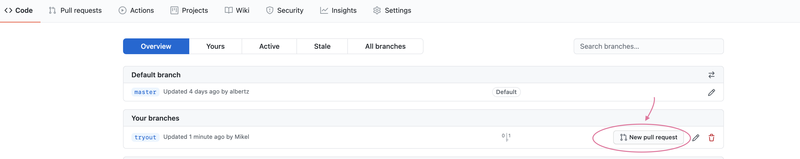

# MSI_2021
Here we host the project from MIS 2021 at FH Aachen


# How to contribute with Git
[Git Introduction Video](https://www.youtube.com/watch?v=vR-y_2zWrIE&list=PLWKjhJtqVAbkFiqHnNaxpOPhh9tSWMXIF&index=3&ab_channel=freeCodeCamp.org)

The issues that keep me comming back consist of:
- Understanding git
  * how to contribute(pull request, sync fork, rebase ..)
  * reverse commits


## Git

In git we have branches and commits all is easy and relaxed. Now, if we want to
contribute in a project involving multiple contributors we follow something like: 

## Setting Up
0. Create a personal fork of the original-project on Github


1. Clone the remote fork-repo on Github localy and call it `origin`
2. Add the original-repo as a remote called `upstream`

```bash
# clone and enter
git clone https://github.com/Theodhor21/MSI_2021.git
cd MSI_2021
# check out the default remotes
git remote -v
# remove unwanted remote
git remote remove origin
# 1. add origin remote to the fork
git remote add origin https://github.com/[myusername]/MSI_2021.git
# 2. add upstream remote to the original repo
git remote add upstream https://github.com/Theodhor21/MSI_2021.git
```

3. Changes done in the original-repo are pulled localy and than if required
   pushed to the remote fork-repo

```bash
git pull upstream main
git push origin main
```

### Adding feature
3. **Create new branch to work on**. Branch from `develop` if it exists else from`main`

```bash
# create branch and then checkout
git branch new_branch
git checkout new_branch
# create and checkout
git checkout -b new_branch
```

4. Add changes, comment them, follow code style, run tests, adapt tests as
   needed, update documentation.

```bash
# create new_file and its test
touch new_file test_new_file
# stage changes to be commited
git add new_file
git add test_new_file
# commit all staged files with message
git commit -a -m "added new file for obvious reasons"
```

5. Squash commits into a single commit with git's [interactive rebase](interactive rebase). 
   Commit messages: Present tense. Describe what the commit, when applied, does to the code. (Not what you did to the code)

```bash
# Start an interactive rebase, which allows the commits to be reordered, omitted, combined or modified
git rebase -i main
```

6. Push the new branch with changes to remote fork-repo(`origin`) on Github.

```bash
git push origin new_branch
```

7. From the remote-fork-repo open a pull request in the branch with the changes.
   Target `develop` or `main` branch of the original-project.



8. Once the pull-request approved and merged, pull and merge locally and update
   the remote-fork-repo by pushing.

```bash
git pull upstream main
git push origin main
```


